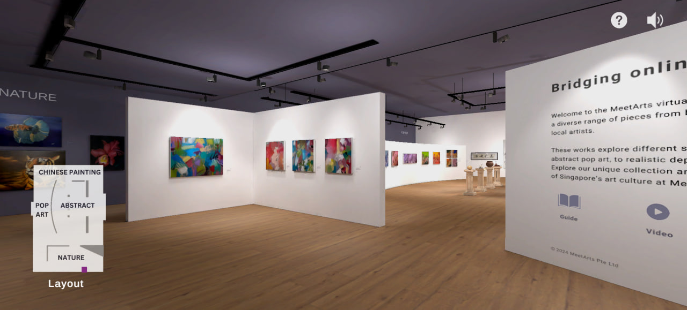
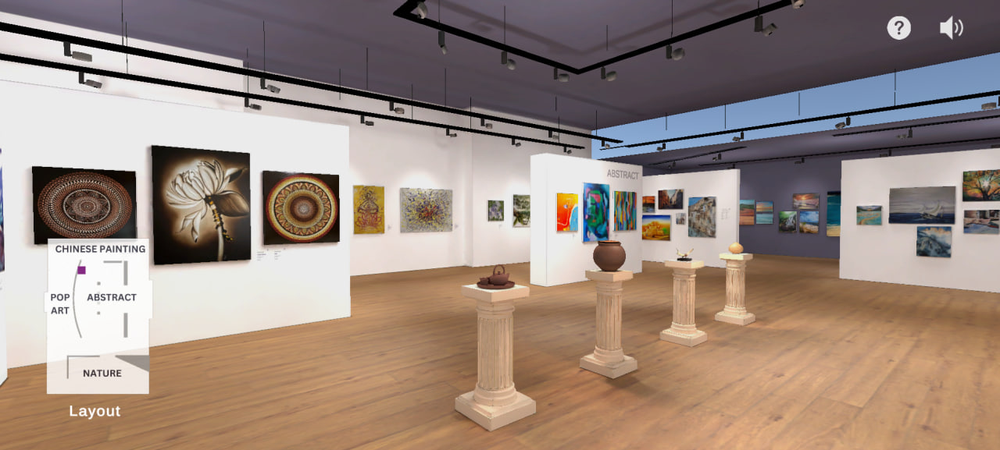

# MeetArts Virtual Gallery
This repository contains the first version of the virtual gallery that I developed for MeetArts (available at https://meetarts-vr.org), hosted for demonstration purposes. It offers an immersive digital art experience for viewers, who can browse through the artworks through first-person POV.  

#### Note
* Only accessible on laptop/ PC. Mobile devices are not supported.
* Please allow up to 2 minutes of loading time.

### Demo
<a href="https://jack1e0.github.io/MeetArts-Virtual-Gallery/" target="_blank">Virtual Gallery Demo</a>

### Features
* First-person perspective and movement
* Clicking on artworks to be brought to their product pages
* Narration upon hovering over artworks
* Immersive music that can be toggled

### Snapshots

